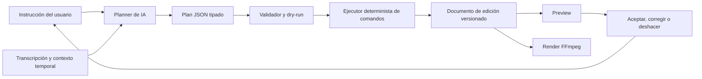

# Backlog — Editor de vídeo conversacional con IA

Este documento ordena la evolución del proyecto desde un transcriptor y resumidor hacia un servicio SaaS de edición de vídeo controlado mediante lenguaje natural. La creación de Shorts/Reels desde contenido largo será el primer recorrido acotado, no el límite del producto.

## Visión del producto

> Subir un vídeo o pegar una URL, describir con palabras el resultado deseado, revisar el plan de edición propuesto por la IA y exportar el vídeo sin dominar un editor profesional.

La experiencia principal será conversacional: el usuario pide cambios como "elimina silencios", "busca cuando habla de precios", "crea un Short de 45 segundos" o "añade subtítulos dinámicos". La IA traduce esas instrucciones a comandos estructurados, seguros, explicables y reversibles. Un timeline manual seguirá disponible para revisar y corregir detalles.

El producto no pretende soportar inicialmente cualquier tipo de edición audiovisual. El MVP se limita a contenido hablado y a un catálogo pequeño de operaciones deterministas. Esta restricción permite validar la edición mediante IA antes de abordar un editor multipista generalista.

### Independencia de OpenCut

- Este proyecto tendrá su propio documento de edición, catálogo de comandos, planner de IA y renderizador FFmpeg.
- OpenCut puede servir como referencia de arquitectura y experiencia de usuario, pero no será una dependencia de ejecución ni bloqueará el roadmap.
- Una futura integración mediante API, MCP o adaptador será opcional y deberá preservar el modelo de dominio propio.

### Cliente inicial propuesto

- Creadores de contenido educativo y entrevistas.
- Podcasters y canales de YouTube.
- Coaches, consultores y equipos de marketing pequeños.
- Agencias que producen varios clips por cada vídeo largo.

### Resultado del MVP

Un usuario puede:

1. Crear un proyecto desde una URL de YouTube o un archivo local.
2. Obtener una transcripción con timestamps.
3. Pedir una edición mediante lenguaje natural.
4. Ver qué entendió la IA, qué operaciones propone y qué advertencias existen.
5. Previsualizar, aceptar, rechazar o corregir el plan sin modificar el original.
6. Continuar la conversación con instrucciones como "hazlo más corto" o "deshaz el último cambio".
7. Ajustar manualmente cortes, encuadre y subtítulos cuando sea necesario.
8. Exportar un MP4 H.264 y, opcionalmente, un archivo SRT.

### Primer catálogo de instrucciones

- Buscar un momento por tema, frase o intención.
- Crear un clip de una duración aproximada.
- Recortar, dividir, eliminar o reordenar fragmentos.
- Eliminar silencios largos y, con confirmación, muletillas.
- Cambiar a 9:16, 1:1 o 16:9 y ajustar el encuadre.
- Añadir, corregir y estilizar subtítulos.
- Normalizar audio y aplicar fades sencillos.
- Exportar utilizando un preset permitido.

### Métricas que deben guiar el producto

- Tiempo desde importación hasta primera propuesta reproducible.
- Tiempo hasta la primera exportación correcta.
- Porcentaje de instrucciones ejecutadas correctamente al primer intento.
- Porcentaje de planes aceptados, corregidos o rechazados.
- Número medio de instrucciones hasta alcanzar el resultado deseado.
- Frecuencia de undo y correcciones manuales por tipo de comando.
- Exportaciones completadas por proyecto.
- Coste de procesamiento y almacenamiento por minuto de vídeo.
- Retención semanal de usuarios que completaron una exportación.

## Principios de implementación

- Priorizar recorridos verticales utilizables sobre subsistemas completos aislados.
- Mantener Python, FastAPI, Whisper y FFmpeg como núcleo de procesamiento.
- Representar la edición mediante un documento JSON no destructivo; nunca modificar el original.
- El modelo de IA nunca ejecuta shell, FFmpeg ni escrituras directas: solo propone comandos tipados de un catálogo permitido.
- Validar permisos, referencias, tiempos, costes y precondiciones antes de aplicar cada comando.
- Mostrar un dry-run comprensible antes de cambios costosos, destructivos en apariencia o difíciles de revisar.
- Registrar plan, comandos, resultado y versión del documento para explicación, auditoría y undo.
- Separar la interpretación probabilística de la ejecución determinista.
- Separar dominio, almacenamiento, trabajos en segundo plano y API para poder migrar de local a SaaS.
- Empezar con una sola pista de vídeo y una pista de subtítulos.
- Evaluar instrucciones representativas mediante fixtures antes de ampliar el catálogo del agente.
- Medir tiempo, errores y coste antes de añadir facturación.
- Evitar WebGPU, WASM, Rust, escritorio, móvil y plugins hasta validar el flujo principal.

## Arquitectura objetivo

### Límites de confianza

- Vídeos, títulos, metadatos y transcripciones son datos no confiables; no pueden ampliar permisos del agente.
- El planner propone intención y comandos, pero no tiene acceso directo al sistema de archivos ni a procesos.
- El validador decide si un plan es ejecutable y qué confirmaciones necesita.
- El ejecutor es la única capa autorizada para crear una nueva revisión del documento.
- El renderizador solo consume documentos validados y construye argumentos FFmpeg mediante APIs seguras.

## Flujo de trabajo con GitHub

- Cada elemento implementable debe entregarse en una PR pequeña contra `main`.
- Nombre de rama recomendado: `codex/<id>-<descripcion-corta>`.
- La PR comienza como draft cuando todavía falten criterios de aceptación.
- Una PR no debe mezclar elementos de distintos hitos salvo una dependencia inseparable y documentada.
- Toda PR debe incluir resumen, riesgos, validación ejecutada y capturas cuando cambie la interfaz.
- Los cambios de esquema necesitan migración, prueba de migración y estrategia de reversión.
- Los cambios arquitectónicos relevantes deben actualizar `AGENTS.md`.
- Una funcionalidad incompleta debe quedar detrás de una bandera o sin exposición en producción.

### Estados

- `[ ]` Pendiente
- `[~]` En curso
- `[x]` Completado
- `[!]` Bloqueado

### Prioridades

- **P0**: necesario para el MVP o para evitar pérdida/exposición de datos.
- **P1**: alto valor después de completar el recorrido principal.
- **P2**: mejora posterior; no debe retrasar el MVP.

### Definición de terminado

Un elemento se considera terminado cuando:

- Cumple todos sus criterios de aceptación.
- Tiene pruebas proporcionales al riesgo.
- No introduce secretos, datos personales ni archivos multimedia en Git.
- La documentación de uso o arquitectura está actualizada cuando corresponde.
- La PR contra `main` está aprobada y sus comprobaciones pasan.

## Secuencia recomendada de PRs

| Orden | ID | Prioridad | Entrega | Depende de |
|---:|---|---|---|---|
| 0 | DOC-001 | P0 | Crear y mantener este backlog | — |
| 1 | QLT-001 | P0 | Consolidar pruebas y CI de referencia | DOC-001 |
| 2 | CORE-001 | P0 | Persistir proyectos y recursos multimedia | QLT-001 |
| 3 | CORE-002 | P0 | Persistir y recuperar trabajos de procesamiento | CORE-001 |
| 4 | TRN-001 | P0 | Generar timestamps por palabra | CORE-002 |
| 5 | EDIT-001 | P0 | Definir y persistir el documento de edición | TRN-001 |
| 6 | CMD-001 | P0 | Ejecutar un catálogo seguro de comandos de edición | EDIT-001 |
| 7 | AI-001 | P0 | Buscar momentos y proponer clips con grounding temporal | TRN-001, CMD-001 |
| 8 | AGENT-001 | P0 | Traducir lenguaje natural a planes estructurados | AI-001, CMD-001 |
| 9 | AGENT-002 | P0 | Añadir conversación, dry-run, aprobación y undo | AGENT-001, CORE-002 |
| 10 | API-001 | P0 | Exponer proyectos, conversación y comandos por API | AGENT-002 |
| 11 | WEB-001 | P0 | Crear el shell del editor conversacional | API-001 |
| 12 | WEB-002 | P0 | Sincronizar chat, vídeo, transcripción y propuestas | WEB-001 |
| 13 | EDIT-002 | P0 | Añadir timeline simple como corrección manual | EDIT-001, WEB-002 |
| 14 | CAP-001 | P0 | Editar y previsualizar subtítulos | EDIT-002 |
| 15 | FMT-001 | P0 | Añadir formatos y encuadre | EDIT-002 |
| 16 | EXP-001 | P0 | Renderizar el documento de edición con FFmpeg | CMD-001, CAP-001, FMT-001 |
| 17 | EXP-002 | P0 | Ejecutar exportaciones durables y descargables | EXP-001, CORE-002 |
| 18 | EVAL-001 | P0 | Evaluar instrucciones y resultados del agente | AGENT-002, EXP-001 |
| 19 | MVP-001 | P0 | Validar el editor conversacional de principio a fin | EVAL-001, EXP-002 |
| 20 | AUTH-001 | P0 SaaS | Añadir cuentas y sesiones | MVP-001 |
| 21 | TEN-001 | P0 SaaS | Aislar datos por workspace | AUTH-001 |
| 22 | STOR-001 | P0 SaaS | Migrar medios a almacenamiento de objetos | TEN-001 |
| 23 | USE-001 | P0 SaaS | Medir uso, costes y aplicar cuotas | STOR-001 |
| 24 | OBS-001 | P0 SaaS | Incorporar observabilidad operativa | CORE-002 |
| 25 | PRIV-001 | P0 SaaS | Retención, borrado y controles de privacidad | TEN-001, STOR-001 |
| 26 | BILL-001 | P1 | Añadir planes y facturación | USE-001 |
| 27 | DEP-001 | P0 SaaS | Desplegar staging y producción | OBS-001, PRIV-001 |

## Hito 0 — Base mantenible

### [~] DOC-001 — Backlog de producto y entrega

**Prioridad:** P0

**Resultado:** Existe una fuente única y ordenada para decidir las siguientes PRs.

**Criterios de aceptación:**

- El backlog expresa visión, alcance del MVP y límites explícitos.
- Los elementos están ordenados y tienen identificadores estables.
- El flujo de PRs usa `main` como rama base.

### [ ] QLT-001 — Pruebas y CI de referencia

**Prioridad:** P0

**Resultado:** Los cambios posteriores pueden detectar regresiones del flujo actual.

**Alcance:**

- Corregir pruebas débiles o que dependan del estado global.
- Aislar uploads, resultados, tareas y modelos pesados mediante fixtures.
- Cubrir archivo válido, URL válida, error de descarga, error de transcripción y consulta de estado.
- Ejecutar lint y pruebas en una GitHub Action sobre PRs a `main`.

**Criterios de aceptación:**

- La suite no descarga modelos ni accede a servicios externos.
- Las pruebas se ejecutan de forma repetible en local y CI.
- El workflow bloquea el merge cuando falla una comprobación requerida.

### [ ] CORE-001 — Modelo persistente de proyectos y medios

**Prioridad:** P0

**Resultado:** Un reinicio no elimina proyectos ni su relación con archivos y transcripciones.

**Alcance:**

- Definir `Project`, `MediaAsset`, `Transcript` y sus estados.
- Añadir un repositorio desacoplado con SQLite como implementación local inicial.
- Crear migraciones versionadas.
- Mantener los binarios fuera de la base de datos.

**Criterios de aceptación:**

- Crear, consultar, listar y eliminar proyectos mediante pruebas.
- Un proyecto conserva sus metadatos después de reiniciar la aplicación.
- Las rutas almacenadas no permiten escapar del directorio de medios configurado.

### [ ] CORE-002 — Trabajos durables de procesamiento

**Prioridad:** P0

**Resultado:** Descargas, transcripciones y análisis dejan de depender de un diccionario en memoria.

**Alcance:**

- Definir `ProcessingJob`, estados, progreso, error y timestamps.
- Unificar el procesamiento de URL y archivo en un servicio común.
- Recuperar o marcar de forma segura trabajos interrumpidos tras un reinicio.
- Diseñar una interfaz de cola que permita una implementación Redis en producción.

**Criterios de aceptación:**

- El estado de un trabajo persiste tras reiniciar el proceso web.
- Los fallos conservan un mensaje seguro para el usuario y detalle técnico en logs.
- Reintentar no crea resultados duplicados ni corrompe el proyecto.

## Hito 1 — Núcleo de edición y comprensión temporal

### [ ] TRN-001 — Timestamps por palabra y captions normalizados

**Prioridad:** P0

**Resultado:** La transcripción puede alimentar subtítulos precisos, búsquedas temporales e instrucciones referidas al contenido.

**Alcance:**

- Activar timestamps por palabra en Faster Whisper.
- Normalizar palabras y segmentos en modelos tipados.
- Mantener compatibilidad con resultados antiguos que solo tengan segmentos.
- Exportar SRT básico desde la transcripción.

**Criterios de aceptación:**

- Cada palabra válida incluye inicio, final y texto.
- Los timestamps son crecientes y permanecen dentro de la duración del medio.
- Existe una prueba con fixture corto que valida segmentación y SRT.

### [ ] EDIT-001 — Documento de edición no destructiva

**Prioridad:** P0

**Resultado:** Frontend, agente y renderizador comparten una representación versionada de la edición.

**Modelo inicial:**

- Fuente multimedia y versión del documento.
- Clips con `sourceStart`, `sourceEnd` y posición en timeline.
- Aspect ratio, resolución, crop y fondo.
- Captions y preset visual.
- Opciones de audio y exportación.
- Revisión actual y referencia a la revisión anterior.

**Criterios de aceptación:**

- El esquema rechaza intervalos imposibles o solapamientos no soportados.
- Guardar y volver a abrir conserva la edición.
- Cada operación válida produce una nueva revisión recuperable.
- Las versiones antiguas tienen una estrategia explícita de migración.

### [ ] CMD-001 — Catálogo y ejecutor de comandos de edición

**Prioridad:** P0

**Resultado:** Tanto la interfaz manual como la IA modifican proyectos mediante las mismas operaciones deterministas.

**Comandos iniciales:**

- `select_range`, `trim_clip`, `split_clip`, `delete_range` y `reorder_clips`.
- `remove_silences` y `remove_filler_words` como comandos compuestos revisables.
- `set_aspect_ratio`, `set_crop` y `set_background`.
- `add_captions`, `update_caption` y `set_caption_style`.
- `normalize_audio`, `add_fade` y `request_export`.

**Criterios de aceptación:**

- Cada comando tiene esquema versionado, precondiciones y resultado tipado.
- El ejecutor no recibe strings de shell ni parámetros FFmpeg arbitrarios.
- Un dry-run devuelve cambios esperados, advertencias y duración resultante sin persistir.
- Aplicar un lote es atómico: todos los comandos se aceptan o ninguno modifica el documento.
- Todo comando aplicado puede deshacerse restaurando una revisión anterior.

### [ ] AI-001 — Grounding temporal y propuestas de clips

**Prioridad:** P0

**Resultado:** La IA puede convertir referencias semánticas en intervalos verificables del vídeo.

**Alcance:**

- Buscar por frase, tema, intención o resumen utilizando la transcripción.
- Producir entre 3 y 5 candidatos con `start`, `end`, evidencia textual y score.
- Generar propuestas que puedan convertirse en `select_range` y comandos posteriores.
- Mantener la búsqueda temporal desacoplada del proveedor de modelos.

**Criterios de aceptación:**

- Cada resultado cita segmentos existentes y permanece dentro de la duración del medio.
- Las propuestas respetan una duración configurable y no cortan palabras.
- Existe un fallback determinista cuando el proveedor de IA no responde.
- El prompt y la respuesta no escriben la transcripción completa en logs.

## Hito 2 — Agente de edición conversacional

### [ ] AGENT-001 — Planner de lenguaje natural

**Prioridad:** P0

**Resultado:** Una instrucción se transforma en un plan estructurado que usa exclusivamente el catálogo permitido.

**Modelo mínimo del plan:**

- Intención interpretada y supuestos.
- Referencias temporales utilizadas como evidencia.
- Comandos ordenados con sus argumentos.
- Cambios esperados, advertencias y duración estimada.
- Preguntas de aclaración solo cuando falte información imprescindible.

**Criterios de aceptación:**

- La salida del modelo se valida contra un esquema estricto antes de ejecutarse.
- Comandos desconocidos o argumentos inválidos se rechazan sin modificar el proyecto.
- El planner puede resolver instrucciones de seguimiento usando la revisión y conversación actuales.
- El usuario recibe una explicación breve de lo que ocurrirá y por qué.
- Proveedor, modelo y prompt quedan versionados para reproducibilidad.

### [ ] AGENT-002 — Conversación, aprobación y undo

**Prioridad:** P0

**Resultado:** El usuario puede revisar, aplicar y corregir iterativamente la edición propuesta por la IA.

**Alcance:**

- Persistir mensajes, planes, decisiones y revisiones del documento.
- Mostrar dry-run antes de aplicar el plan.
- Acciones aceptar, rechazar, editar plan, deshacer y rehacer.
- Instrucciones de seguimiento como "hazlo más corto" o "vuelve al encuadre anterior".
- Requerir confirmación para operaciones costosas o ambiguas.

**Criterios de aceptación:**

- Reenviar una solicitud con la misma clave idempotente no aplica dos veces el plan.
- Undo restaura el documento exacto sin pedir al modelo que reconstruya el estado.
- La conversación no es la fuente de verdad; el documento y su historial sí lo son.
- El contexto enviado al modelo excluye secretos y se limita a lo necesario.

### [ ] API-001 — API de proyectos, conversación y comandos

**Prioridad:** P0

**Resultado:** El frontend puede operar el editor conversacional sin acceder al sistema de archivos ni ejecutar operaciones privilegiadas.

**Alcance:**

- Endpoints para crear, listar y consultar proyectos.
- Endpoints para enviar instrucciones y consultar el progreso del planner.
- Endpoints para dry-run, aceptar, rechazar, undo y redo.
- Endpoints para consultar revisiones, propuestas y estado de trabajos.
- Respuestas tipadas y errores consistentes.

**Criterios de aceptación:**

- OpenAPI refleja los modelos reales de plan, comando y revisión.
- La API nunca expone rutas absolutas del servidor.
- El cliente no puede saltarse validación invocando directamente FFmpeg.
- Las pruebas cubren estados válidos, recursos inexistentes y transiciones inválidas.

## Hito 3 — Experiencia del editor

### [ ] WEB-001 — Shell React y TypeScript del editor conversacional

**Prioridad:** P0

**Resultado:** Existe una base mantenible para chat, preview y estado de edición sin eliminar prematuramente el flujo web actual.

**Alcance:**

- Elegir y documentar el sistema de build.
- Crear rutas de proyectos y editor.
- Crear el panel de conversación, preview y resumen del plan.
- Integrar el artefacto frontend con FastAPI/Docker mediante build reproducible.
- Añadir manejo de carga, error y proyecto inexistente.

**Criterios de aceptación:**

- El build frontend es reproducible en CI y Docker.
- La aplicación actual sigue permitiendo importar un medio.
- La ruta del editor abre un proyecto real desde la API.
- El usuario distingue con claridad plan pendiente, cambios aplicados y errores.

### [ ] WEB-002 — Chat, reproductor y transcripción sincronizados

**Prioridad:** P0

**Resultado:** El usuario puede comprobar visualmente que la IA entendió la referencia temporal y el cambio solicitado.

**Alcance:**

- Reproductor con seek desde evidencia, segmento o palabra.
- Resaltado del texto correspondiente al tiempo actual.
- Visualización de rangos afectados antes y después del plan.
- Acciones aceptar, rechazar, corregir y abrir en timeline.

**Criterios de aceptación:**

- Seleccionar evidencia reproduce exactamente su intervalo.
- El dry-run diferencia el estado actual del estado propuesto.
- La reproducción se detiene o reinicia al alcanzar el final del candidato.
- Controles esenciales son utilizables con teclado.

### [ ] EDIT-002 — Timeline de una pista como corrección manual

**Prioridad:** P0

**Resultado:** El usuario puede ajustar el resultado del agente sin necesitar un editor profesional.

**Alcance:**

- Playhead, zoom y waveform simplificado.
- Trim de inicio y final.
- Split en el playhead, eliminar y reordenar clips.
- Undo/redo usando el mismo ejecutor de comandos que el agente.

**Criterios de aceptación:**

- Ninguna operación modifica el archivo fuente.
- Una acción manual y una instrucción de IA producen el mismo tipo de revisión.
- Los límites respetan duración mínima y duración de la fuente.
- Timeline y reproductor permanecen sincronizados.

### [ ] CAP-001 — Editor y presets de subtítulos

**Prioridad:** P0

**Resultado:** La IA puede añadir subtítulos y el usuario puede corregirlos visualmente.

**Alcance:**

- Comandos conversacionales para añadir, corregir y cambiar preset.
- Edición manual de texto y tiempos.
- División y unión de captions.
- Presets iniciales: limpio, alto contraste y palabra activa.
- Posición, tamaño y colores con límites seguros.

**Criterios de aceptación:**

- Cambios de texto y tiempo aparecen en preview y persisten.
- El sistema evita captions vacíos o tiempos invertidos.
- El mismo documento produce SRT y subtítulos quemados coherentes.

### [ ] FMT-001 — Formatos y encuadre

**Prioridad:** P0

**Resultado:** El usuario puede pedir un formato o encuadre y corregirlo manualmente.

**Alcance:**

- Presets 9:16, 1:1 y 16:9.
- Comandos conversacionales y crop manual con preview.
- Modos fit, fill y fondo desenfocado.
- Resoluciones de salida seguras y configurables.

**Criterios de aceptación:**

- Cambiar formato no altera los tiempos de edición.
- El crop se valida dentro de los límites de la fuente.
- Preview y render utilizan la misma interpretación del encuadre.

## Hito 4 — Renderizado y evaluación

### [ ] EXP-001 — Motor de render FFmpeg

**Prioridad:** P0

**Resultado:** El documento de edición genera un MP4 reproducible sin confiar en comandos libres del modelo.

**Alcance:**

- Traducir el documento de edición a una invocación FFmpeg segura.
- Cortar y concatenar clips.
- Aplicar crop, scale, fondo, audio y captions.
- Exportar MP4 H.264/AAC con presets de calidad limitados.

**Criterios de aceptación:**

- No se construyen comandos mediante interpolación de shell insegura.
- Solo el renderizador traduce el documento validado a argumentos FFmpeg.
- La duración del resultado coincide con la timeline dentro de una tolerancia documentada.
- Audio y vídeo permanecen sincronizados.
- Fixtures de 9:16 y 16:9 se validan con `ffprobe`.

### [ ] EXP-002 — Trabajos de exportación y descargas

**Prioridad:** P0

**Resultado:** Exportar no bloquea el servidor web y el usuario conoce el progreso.

**Alcance:**

- Cola, cancelación y reintentos controlados.
- Progreso persistente y estados terminales claros.
- URL de descarga temporal o endpoint autorizado.
- Política de limpieza de temporales y exportaciones caducadas.

**Criterios de aceptación:**

- Reiniciar el servidor web no pierde el registro de la exportación.
- Dos solicitudes idénticas no pisan el mismo archivo.
- Cancelar termina el proceso hijo y limpia temporales.

### [ ] EVAL-001 — Evaluaciones del agente de edición

**Prioridad:** P0

**Resultado:** Ampliar prompts o modelos no degrada silenciosamente la interpretación de instrucciones.

**Alcance:**

- Dataset versionado de instrucciones en español e inglés sobre fixtures propios.
- Casos simples, seguimientos, ambigüedad, comandos inválidos y prompt injection dentro de metadatos o transcripciones.
- Métricas de selección temporal, validez de comandos, éxito de ejecución y necesidad de corrección.
- Evaluaciones deterministas del documento final además de evaluación semántica del plan.

**Criterios de aceptación:**

- Ninguna evaluación necesita red ni contenido con copyright.
- CI valida esquemas, comandos y documentos finales de los casos críticos.
- Cambiar proveedor, modelo o prompt produce un informe comparable.
- Los fallos muestran la instrucción, el plan sanitizado y la diferencia esperada.

### [ ] MVP-001 — Recorrido conversacional end-to-end

**Prioridad:** P0

**Resultado:** El editor mediante lenguaje natural funciona de principio a fin en Docker.

**Criterios de aceptación:**

- Una prueba end-to-end usa un fixture propio y no accede a YouTube.
- Archivo → transcripción → instrucción → dry-run → aprobación → preview → MP4 funciona en un entorno limpio.
- El flujo soporta al menos búsqueda temática, recorte, eliminación de silencios, formato vertical y subtítulos.
- Undo restaura la versión anterior y una instrucción de seguimiento modifica la revisión vigente.
- Los errores de cada etapa se muestran con una acción de recuperación.
- README y documentación de Docker explican el flujo completo.

## Hito 5 — Preparación SaaS

Este hito comienza después de validar que usuarios reales pueden pedir, revisar y completar ediciones mediante conversación. Las decisiones de proveedor deben quedar detrás de interfaces para evitar acoplamiento innecesario.

### [ ] AUTH-001 — Cuentas y sesiones

**Prioridad:** P0 SaaS

**Criterios de aceptación:**

- Registro/inicio de sesión o proveedor externo documentado.
- Cookies seguras, protección CSRF cuando corresponda y cierre de sesión.
- Los endpoints privados rechazan sesiones inexistentes o expiradas.

### [ ] TEN-001 — Workspaces y aislamiento multi-tenant

**Prioridad:** P0 SaaS

**Criterios de aceptación:**

- Todo proyecto, medio, trabajo y exportación pertenece a un workspace.
- Consultas y descargas verifican pertenencia en el servidor.
- Pruebas negativas demuestran que un usuario no accede a datos de otro workspace.

### [ ] STOR-001 — Almacenamiento de objetos

**Prioridad:** P0 SaaS

**Criterios de aceptación:**

- Existe una interfaz común para filesystem local y almacenamiento S3-compatible.
- Uploads y descargas grandes no atraviesan innecesariamente la memoria del proceso web.
- Los objetos usan claves no predecibles y URLs temporales.
- El borrado de proyecto elimina o agenda todos sus objetos asociados.

### [ ] USE-001 — Medición de uso y cuotas

**Prioridad:** P0 SaaS

**Medidas mínimas:**

- Minutos importados y transcritos.
- Minutos exportados.
- Bytes almacenados.
- Instrucciones, tokens y coste por proveedor/modelo de IA.
- Tiempo del planner, ejecutor y worker de render.

**Criterios de aceptación:**

- Los eventos son idempotentes y auditables.
- Los límites se aplican en el servidor antes de comenzar trabajo costoso.
- El usuario puede consultar su consumo y entender por qué un trabajo fue rechazado.

### [ ] OBS-001 — Logs, métricas y trazabilidad

**Prioridad:** P0 SaaS

**Criterios de aceptación:**

- Cada petición y trabajo tiene un identificador de correlación.
- Logs estructurados no contienen tokens, cookies, transcripciones completas ni URLs firmadas.
- Se miden duración, cola, éxito y error por etapa y tipo de comando.
- Es posible seguir una instrucción desde el mensaje hasta la revisión y exportación resultantes.
- Existen alertas para acumulación de trabajos y tasa anormal de fallos.

### [ ] PRIV-001 — Privacidad, retención y borrado

**Prioridad:** P0 SaaS

**Criterios de aceptación:**

- La política de retención de originales, temporales y exportaciones es configurable.
- Conversaciones, planes y revisiones tienen una política de retención explícita.
- El usuario puede borrar un proyecto y solicitar borrado de cuenta.
- El proceso de borrado abarca base de datos, objetos, cachés y trabajos pendientes.
- Antes de la beta pública se revisan derechos de contenido y términos de las plataformas importadas.

### [ ] BILL-001 — Planes y facturación

**Prioridad:** P1

**Criterios de aceptación:**

- Los planes se expresan como permisos y cuotas internas, no como condicionales dispersos.
- Los webhooks son verificados, idempotentes y reintentables.
- Cancelaciones, impagos y cambios de plan tienen estados probados.
- El sistema puede operar en modo gratuito limitado sin proveedor de pago durante desarrollo.

### [ ] DEP-001 — Staging y producción

**Prioridad:** P0 SaaS

**Criterios de aceptación:**

- Web, worker, base de datos y almacenamiento tienen configuración separada por entorno.
- Migraciones se ejecutan de forma controlada.
- Secretos no viven en imágenes Docker ni en el repositorio.
- Existen health checks, backups verificados y procedimiento de rollback.

## Hito 6 — Crecimiento, después del MVP

### [ ] GROW-001 — Plantillas reutilizables

**Prioridad:** P1

- Guardar estilos de captions, formato, crop y exportación como plantilla.
- Aplicar una plantilla sin alterar la fuente ni los timestamps.

### [ ] GROW-002 — Exportación de variantes por lote

**Prioridad:** P1

- Generar múltiples propuestas y formatos desde un proyecto.
- Limitar concurrencia y mostrar coste estimado antes de iniciar.

### [ ] GROW-003 — Brand kits y equipos

**Prioridad:** P1

- Colores, fuentes, logos y presets por workspace.
- Roles mínimos de propietario y miembro.

### [ ] GROW-004 — Música, imágenes y B-roll

**Prioridad:** P2

- Añadir una pista secundaria limitada.
- Controlar volumen, fades y atribución/licencia de recursos externos.

### [ ] GROW-005 — Publicación asistida

**Prioridad:** P2

- Generar título, descripción, hashtags y thumbnail.
- Mantener la publicación directa fuera de alcance hasta validar permisos y APIs por plataforma.

## Fuera de alcance por ahora

- Agente completamente autónomo que publique o ejecute operaciones costosas sin confirmación.
- Permitir al modelo generar shell, filtros FFmpeg libres o código ejecutable.
- Editor multipista profesional completo.
- Colaboración simultánea en tiempo real.
- Keyframes avanzados, máscaras, tracking y efectos GPU.
- Compositor WebGPU/WASM o núcleo Rust.
- Aplicaciones nativas de escritorio y móvil.
- Marketplace de plugins y servidor MCP.
- Clonar toda la experiencia o arquitectura de OpenCut.

## Riesgos que deben revisarse en cada hito

- **Coste:** transcripción, IA, render y almacenamiento pueden destruir el margen si no se miden.
- **Fiabilidad:** los trabajos largos deben sobrevivir reinicios y admitir reintentos seguros.
- **Interpretación:** un plan válido puede no representar la intención real; dry-run, evidencia y undo son obligatorios.
- **Prompt injection:** transcripciones, títulos y metadatos externos son datos no confiables, nunca instrucciones del sistema.
- **Consistencia:** preview y render deben interpretar el mismo documento sin diferencias sorprendentes.
- **Seguridad:** uploads, URLs, FFmpeg, modelos y separación entre tenants amplían la superficie de ataque.
- **Privacidad:** vídeos y transcripciones pueden contener datos sensibles.
- **Dependencia de proveedor:** prompts, modelos y costes pueden cambiar; contratos y evaluaciones deben ser portables.
- **Derechos de contenido:** el usuario debe tener autorización para descargar, procesar y publicar el material.
- **Alcance:** las funciones de editor generalista pueden retrasar indefinidamente la propuesta principal.

## Preguntas de producto pendientes

- ¿Cuál será el primer nicho: podcasts, educación, coaches o agencias?
- ¿Qué instrucciones compondrán el catálogo cerrado de la primera beta?
- ¿Qué operaciones necesitan siempre confirmación explícita?
- ¿Qué duración por defecto deben tener los clips sugeridos?
- ¿Cuánto contexto conversacional y temporal necesita el planner para mantener calidad sin disparar costes?
- ¿El primer despliegue usará CPU, GPU dedicada o proveedor de transcripción?
- ¿Cuánto tiempo se conservarán originales y exportaciones por plan?
- ¿La primera beta será gratuita con invitación o tendrá pago desde el inicio?
- ¿Qué idiomas deben recibir calidad de primera clase en el MVP?
